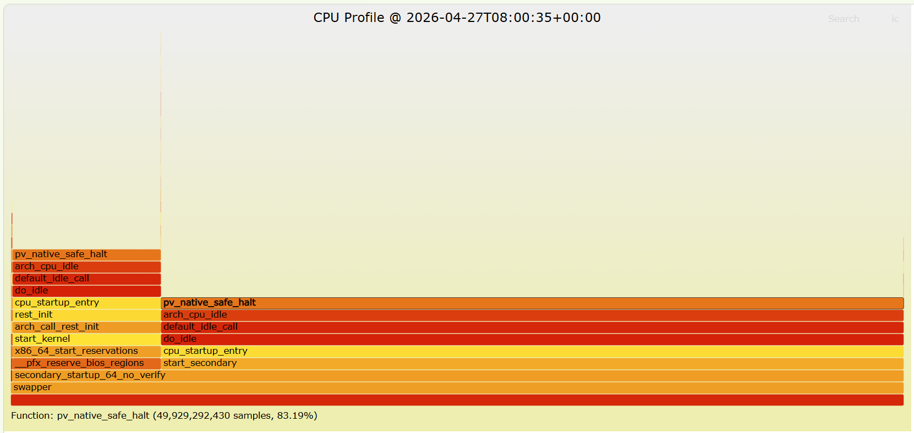

# Linux Continuous CPU Profiler

一个面向 Linux 生产环境的持续 CPU Profiling 工具原型，目标是让 `perf` 像黑匣子一样 7x24 常驻后台运行，按时间片持续采样，并在故障发生后根据指定时间点快速回放对应的 CPU 样本，导出火焰图定位热点。



技术路线是：

1. 用 Linux 原生 `perf` 负责系统级 CPU 采样。
2. 用 Python 常驻进程负责分片采样、目录轮转、元数据索引和按时间点检索。
3. 用 Brendan Gregg 的 FlameGraph 脚本把 `perf script` 输出转换为火焰图。
4. 用 `systemd` 把采集器做成守护进程，保证开机自启、自动拉起和日志归档。

这条路线的优点：

- 内核能力成熟，`perf` 在生产环境可用性高。
- 不需要自己实现采样器，风险集中在调度、索引和运维包装层。
- 交付速度快，30 分钟内可以完成一个能跑通的最小生产版。
- 后续可逐步演进到 eBPF/Parca/Pyroscope，而不推翻采集与检索模型。

## 技术栈

- 采样器：`perf`
- 火焰图：`perf script` + `stackcollapse-perf.pl` + `flamegraph.pl`
- 编排语言：Python 3.11+
- 进程守护：`systemd`
- 配置格式：JSON
- 数据组织：`perf.data` 分片文件 + JSON 元数据索引

## 可实现方案

### 方案 A：`perf` 分片轮转 + 本地火焰图，推荐

实现方式：

- 每 60 秒执行一次 `perf record -a -g ... -- sleep 60`
- 每个时间片生成一个 `perf.data`
- 同时写一个 JSON 元数据，记录开始时间、结束时间、命令行、退出码
- 保留最近 N 小时数据，超出自动清理
- 故障后指定时间点，自动挑选覆盖该时间点的时间片并导出火焰图

适用场景：

- 单机排障
- 裸机/虚机 Linux 服务
- 先做黑匣子式持续采样，再逐步平台化

优点：

- 路径最短，部署简单
- 与 Linux 工具链天然兼容
- 对现网侵入低

缺点：

- 火焰图依赖额外脚本
- 多机场景需要额外做汇聚

### 方案 B：`perf` 常驻写环形缓冲区 + 定点切档

实现方式：

- 使用 `perf record --switch-output` 或外部信号触发切档
- 由守护程序管理目录与切片

优点：

- 更接近“黑匣子”语义
- 切片更平滑

缺点：

- 对 `perf` 版本和运行细节更敏感
- 30 分钟内做稳健封装的风险更高

### 方案 C：eBPF + Parca/Pyroscope 持续 Profiling 平台

实现方式：

- 使用 eBPF profiler 持续采样
- 汇聚到 Parca / Pyroscope 后端

优点：

- 平台化能力强，查询与可视化完善
- 多机统一治理更容易

缺点：

- 部署复杂度高
- 对内核、权限、网络和存储都有更高要求
- 不适合“30 分钟内交付一个可用黑匣子工具”的目标

## 当前实现范围

当前项目实现的是方案 A，并补齐了以下内容：

- Python CLI：支持单次采集、持续采集、列出时间片、按时间点导出火焰图
- 自动 retention 清理
- 时间片元数据索引
- `systemd` service 示例
- FlameGraph 安装脚本
- Trae Skill，可复用到后续类似题目

## 目录结构

```text
.
|-- .trae/skills/linux-continuous-cpu-profiler/SKILL.md
|-- deploy/systemd/continuous-cpu-profiler.service
|-- examples/profiler-config.json
|-- scripts/install_flamegraph.sh
|-- src/continuous_cpu_profiler/
|   |-- __init__.py
|   |-- cli.py
|   |-- collector.py
|   |-- config.py
|   |-- query.py
|   `-- retention.py
`-- tests/test_query.py
```

## 快速开始

1. 安装依赖：

```bash
sudo apt-get update
sudo apt-get install -y linux-tools-common linux-tools-generic linux-tools-$(uname -r) perl python3
```

2. 安装 FlameGraph：

```bash
bash scripts/install_flamegraph.sh /opt/FlameGraph
```

3. 调整权限：

```bash
sudo sysctl -w kernel.perf_event_paranoid=1
sudo sysctl -w kernel.kptr_restrict=0
```

4. 修改配置：

```bash
cp examples/profiler-config.json /etc/continuous-cpu-profiler.json
```

5. 启动单次采样：

```bash
python -m continuous_cpu_profiler.cli once --config /etc/continuous-cpu-profiler.json
```

6. 持续运行：

```bash
python -m continuous_cpu_profiler.cli collect --config /etc/continuous-cpu-profiler.json
```

7. 指定时间点导出火焰图：

```bash
python -m continuous_cpu_profiler.cli query \
  --config /etc/continuous-cpu-profiler.json \
  --at 2026-04-27T10:12:00+08:00 \
  --output-dir /tmp/profile-query
```

## 生产建议

- 采样频率建议从 `99Hz` 起步，先控制开销，再逐步提升。
- 时间片建议 `30s` 到 `120s`，过短会增加文件数量，过长会降低定位精度。
- 默认采用 frame pointer 回溯，业务程序建议开启 frame pointer 编译选项。
- 用 `systemd` 守护时建议单独账户运行，并限制写目录。
- 多机场景建议后续增加对象存储归档与中心化索引。
- 容器环境中需要额外确认 `perf_event_open`、`CAP_PERFMON` 或特权权限。

## 注意事项

- 本项目代码可在 Windows 上编辑，但运行目标是 Linux。
- 如果 FlameGraph 脚本不存在，查询命令仍可保留原始 `perf.data`，但无法直接生成 SVG 火焰图。
- 若需要更强的平台能力，建议在此基础上演进到 Parca / Pyroscope。
